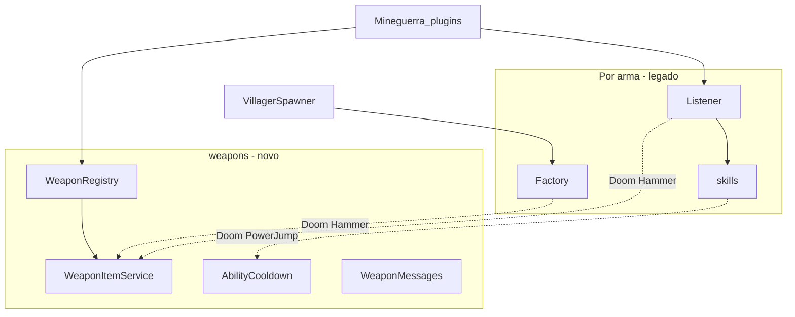

# Arquitetura — estado atual (AS-IS)

## Visão geral



## Padrão package-per-weapon

Cada arma vive em seu pacote:

```
{arma}/
  {Arma}Factory.java    # ItemStack + CMD (+ lore variável)
  {Arma}Listener.java   # @EventHandler + HashMap estado
  {Arma}Command.java    # grant item
  skills/               # efeitos, BukkitRunnable, partículas
```

**Sem** herança comum, **sem** registry central (exceto piloto Doom via `WeaponRegistry`).

## Identificação de itens

| Mecanismo | Uso |
|-----------|-----|
| `CustomModelData` 10001–10004 | Todas as armas |
| `Material` explícito | Só Doom Hammer (legado + migrado) |
| PDC `mineguerra:weapon_id` | Só itens criados por `WeaponItemService` |
| `PersistentDataContainer` | Piloto Doom; demais: não |

Risco: item vanilla com mesmo CMD forjado/comandos pode ser tratado como arma.

## Modos de ativação (3)

| Modo | Armas | Evento |
|------|-------|--------|
| Sneak + swap hands (F) | Soulflayer, Storm Rider | `PlayerSwapHandItemsEvent` |
| Right-click | Dragon Slayer, Doom Hammer | `PlayerInteractEvent` |
| Cadeia projétil | Bow ultimate, Trident teleport | `EntityShootBowEvent` / `ProjectileHitEvent` |

Estado “armado” (`Set<UUID>`): bow `ultimateReady`, storm `activeModeEnabled`.

## Cooldown — quatro padrões legados

| ID | Descrição | Exemplo |
|----|-----------|---------|
| A | CD no sucesso do efeito | Storm teleport, Doom jump (pré-migração), Hellfire no tiro |
| B | CD ao passar check (antes do efeito) | Dragon's Breath |
| C | CD silencioso | Rage of the Dragon |
| D | `checkCooldown` privado no listener | Soulflayer ultimate toggle |

Implementação comum legada: `Map<UUID, Long>` + `System.currentTimeMillis()`.

Problemas:

- Comentários incorretos nos listeners (`90000 // 1 segundo`)
- Sem barra vanilla `player.setCooldown`
- Maps fragmentados (Dragon: 2 skills, 2 maps)
- CD volátil (perde no restart)

**Piloto Doom:** `AbilityCooldown` com `ON_SUCCESS` + mensagens `WeaponMessages`.

## Feedback visual / UX

| Canal | Uso |
|-------|-----|
| Chat | Principal; prefixos inconsistentes |
| Som | Por skill |
| Partículas | Skills pesadas |
| Lore item | Variável; Storm sem lore; Doom tinha placeholder |
| Action bar | Não usado |

API de cor: mistura `ChatColor` e `§`.

## Registro no servidor

`Mineguerra_plugins.onEnable`:

1. `WeaponRegistry.init(this)` — piloto
2. Registra 4 listeners
3. Registra comandos

## Dívidas técnicas (priorizadas)

1. Duplicação de `isHolding*` e CMD em 4 listeners
2. Dragon Slayer: `PlayerInteractEvent` sem `EquipmentSlot.HAND`
3. Dragon's Breath: momento do CD
4. Storm / Bow: assimetria de quando CD é consumido
5. `SoulflayerBowFactory.createStarShooter()` vs nome público
6. Lightning com dano no Thunder Teleport
7. `grant*` sem permissions
8. CMD duplicado em vários arquivos até migração total para `WeaponId`

## Alvo

Ver [STANDARDS_TARGET.md](STANDARDS_TARGET.md) e pacote `org.lseixas.mineguerra_plugins.weapons`.
